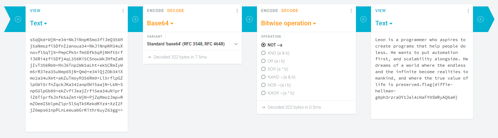

The contents of ciphertext.txt is easily recognisable as Base64-encoded data:

	s5qQkd+WjN+e34+NkJiNnpKSmo3fiJeQ356Mj5aNmozfi5DfnI2anoua34+NkJiNnpKM34uXnovfl5qTj9+PmpCPk5rfm5Dfk5qMjNHft5rfiJ6Ri4zfi5Dfj4qL356Ki5CSnouWkJHfmZaNjIvT356Rm9+MnJ6Tnp2Wk5aLht+ek5CRmIyWm5rR37ea35uNmp6SjN+Qmd+e34iQjZOb34iXmo2a34uXmt+akZuTmoyM356Rm9+Ll5rflpGZlpGWi5rfnZqckJKa342anpOWi5aajN+LkN+SnpGUlpGb09+ekZvfiJeajZrfi5ea34uNiprfiZ6TiprfkJnfk5aZmt+WjN+PjZqMmo2JmpvRmZOemISblpmZlprSl5qTk5KekdKYz4+XzI2FjZ6wps61npPLnLeeuabGrKithr6uyZ63gg==

The natural temptation is to just throw that into an online decoder, but this is a bad idea. Here's why:
	
	When decoded into utf-8 with an online decoder, invalid characters are simply omitted.
	The remaining characters, in this case, are ߖߞߏ߈ߞߋߜߏߋߗߏߛߓ߷߈ߋߏߞߙߞߌߞ߷ߛߐߞ߈߈ߋߚߞߋߖߝߍߋߒߞ߈ߋߋ߉ߐߓߖߏљҗҘϏ̍ε˜Ƭɞ
	That's 48 characters of N'ko, a right-to left West African script, followed by 8 characters of cyrillic.
	It's worth noting that there are 27 *unique* characters.
	This naturally led us to believe it to be a simple substitution cipher, perhaps one involving "yeet".

	It's not.
	

Since we want *all* the data, not just the valid utf-8 characters, we have to decode into hex:

	b39a9091df968cdf9edf8f8d90988d9e92929a8ddf889790df9e8c8f968d9a8cdf8b90df9c8d9a9e8b9adf8f8d90988d9e928cdf8b979e8bdf979a938fdf8f9a908f939adf9b90df939a8c8cd1dfb79adf889e918b8cdf8b90df8f8a8bdf9e8a8b90929e8b969091df99968d8c8bd3df9e919bdf8c9c9e939e9d9693968b86df9e939091988c969b9ad1dfb79adf9b8d9a9e928cdf9099df9edf88908d939bdf88979a8d9adf8b979adf9a919b939a8c8cdf9e919bdf8b979adf9691999691968b9adf9d9a9c90929adf8d9a9e93968b969a8cdf8b90df929e919496919bd3df9e919bdf88979a8d9adf8b979adf8b8d8a9adf899e938a9adf9099df9396999adf968cdf8f8d9a8c9a8d899a9bd199939e98849b969999969ad2979a9393929e91d298cf8f97cc8d858d9eb0a6ceb59e93cb9cb79eb9a6c6aca8ad86beaec99eb782

Of course, this needs to be decoded somehow.

For us, we just couldn't get "yeet" out of our mind, especially this line:

	"single yeet yeeted with single yeet == 0"
	
Perhaps this is a hint, meaning "1 XOR 1 == 0"

Perhaps we have to XOR the hex, perhaps even with the hex translation of the ASCII "yeet" (79656574)

Nope.

Yeet is irrelevant.

XOR is irrelevant.

N'ko is irrelevant.

Cyrillic is irrelevant.

BabyCrypto is laughing at you.

Literally, you perform a bitwise NOT operation, which gives:

	"Leon is a programmer who aspires to create programs that help people do less. He wants to put automation first, and scalability alongside. He dreams of a world where the endless and the infinite become realities to mankind, and where the true value of life is preserved.flag{diffie-hellman-g0ph3rzraOY1Jal4cHaFY9SWRyAQ6aH}"
	
Which of course is just a bunch of fluff, followed by the flag:	
	
	flag{diffie-hellman-g0ph3rzraOY1Jal4cHaFY9SWRyAQ6aH}

Altogether, it's a two-step process, the first of which (decocding the base64) shouldn't even count.
The only tip-off we could find that you have to NOT is that if you look at the binary of ciphertext (opposed to hex), you can see every byte starts with 1.
This means if you convert to ASCII, it'll be in the 128-255 range, rather than the 0-127 range where the regualar characters reside.
You can also see this (less obviously) if you group your hex into bytes: every byte starts with 8-f, never 0-7.
Of course, this is something we realized only after just finding it through dumb luck.

Basically, this whole challenge is an exercise in overthinking.

The following image shows the full conversion from ciphertext.txt to flagtext, using cryptii.com

If you look carefully, you'll find something else in the image, too ;)

Happy Hacking!
